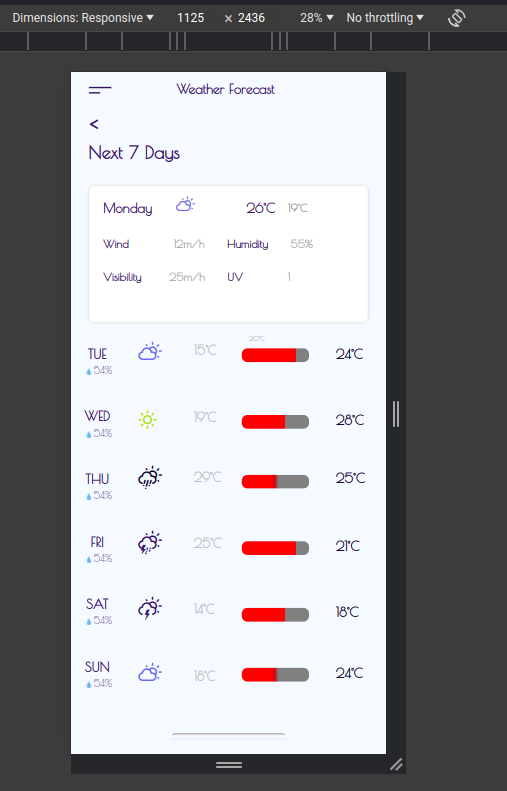
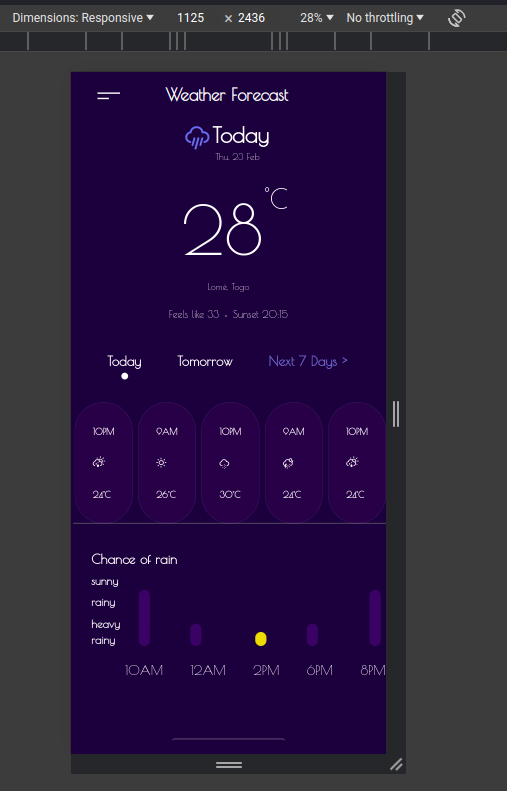

# 📗 Table of Contents

- [📗 Table of Contents](#-table-of-contents)
- [📖 Bennu Weather Forecast App](#-bennu-weather-forecast-app)
  - [🛠 Built With](#-built-with)
    - [Tech Stack](#tech-stack)
    - [Key Features](#key-features)
  - [Screen Shots](#screen-shots)
  - [💻 Getting Started](#-getting-started)
    - [Prerequisites](#prerequisites)
    - [Setup](#setup)
    - [Install](#install)
  - [👥 Authors](#-authors)
  - [🔭 Future Features](#-future-features)
  - [🤝 Contributing](#-contributing)
  - [⭐️ Show your support](#️-show-your-support)
  - [🙏 Acknowledgments](#-acknowledgments)
  - [📝 License](#-license)

# 📖 Bennu Weather Forecast App 

- Bennu Weather Forecast App is a web application that provides weather forecasts for the next 7 days. It offers a clean and user-friendly interface to check the weather conditions, temperatures, and other relevant details.

## 🛠 Built With 

### Tech Stack 

- This is a mobile and desktop browser responsive website.

  Client
  
REACT, TS(Typescript), CSS, BOOTSTRAP
- Technologies Used: CSS, TS, REACT, GIT

### Key Features 

- Display weather forecasts for the next 7 days.
- Provide temperature details.
- Include weather icons for easy identification.
- User-friendly design.

<!-- LIVE DEMO -->

## Screen Shots 

(<a href="#readme-top">back to top</a>)

## 💻 Getting Started 

To get a local copy up and running, follow these steps.

### Prerequisites

In order to run this project, you need:

- Git
- Code Editor (VSCode, Atom, etc.)

### Setup

Clone this repository to your desired folder:

- `git clone [https://github.com/GhostEsso/bennu-weather-app-tsx]`
- `cd bennu-weather-forecast-app`

### Install

Install the project dependencies:

- `npm install`

Run the application:

- `npm start`

## 👥 Authors 

👤 **Essohanam TAMBANA**

- GitHub: [@GhostEsso](https://github.com/GhostEsso)
- Twitter: [@TambanaEssohanam](https://twitter.com/TambanaEssohana)
- LinkedIn: [@TambanaEssohanam](https://www.linkedin.com/in/essohanam-tambana/)

(<a href="#readme-top">back to top</a>)

## 🔭 Future Features 

- Enhance styling.
- Add additional weather details.
- Implement user authentication for personalized forecasts.

(<a href="#readme-top">back to top</a>)

## 🤝 Contributing 

Contributions, issues, and feature requests are welcome!

Feel free to check the [issues page](#) for any existing issues.

(<a href="#readme-top">back to top</a>)

## ⭐️ Show your support 

If you like this project, please give it a star! If you have suggestions on how to improve it, feel free to reach out.

(<a href="#readme-top">back to top</a>)

## 🙏 Acknowledgments 

- Thanks to Bennu for providing the opportunity to learn and work on that test! I've learned a lot.

(<a href="#readme-top">back to top</a>)

## 📝 License 

This project is [MIT](./LICENSE) licensed.